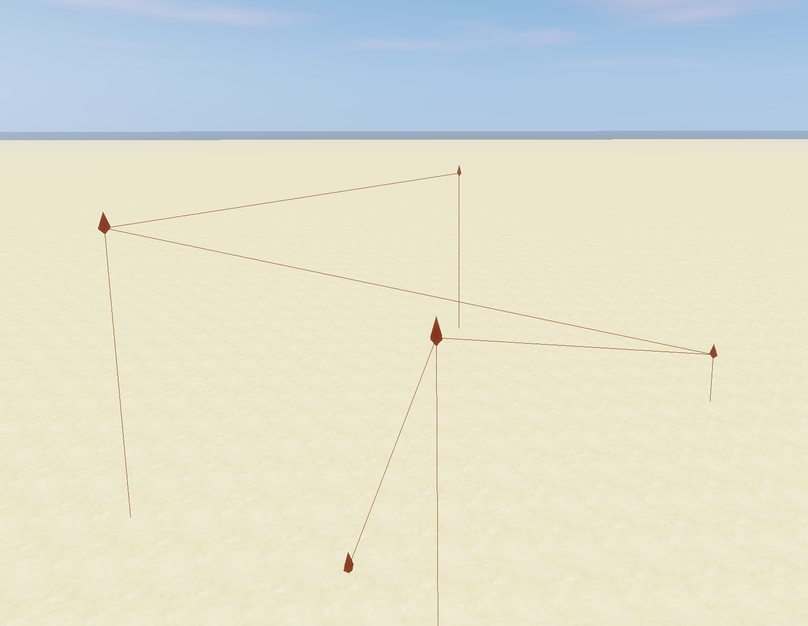

# Build It Parallel
Tool for preserving coordinate data, generating parallel lines, and (hopefully) increasing build quality 
and efficiency while working on the BuildTheEarth project.

## Version 1.0.1.2 
### Features
* Keybind to create a node
* Keybind to delete nodes
* Nodes connect to each other and the ground with lines

> [!IMPORTANT]
> Known Incompatibilities:
> - ReplayMod

## Credits
* kurrycat - for the tremendous rendering help 
* Forge Documentation - for slightly helping to make things make sense 
* XboxBedrock - for assisting with gradle setup

## Funny Screenshot
